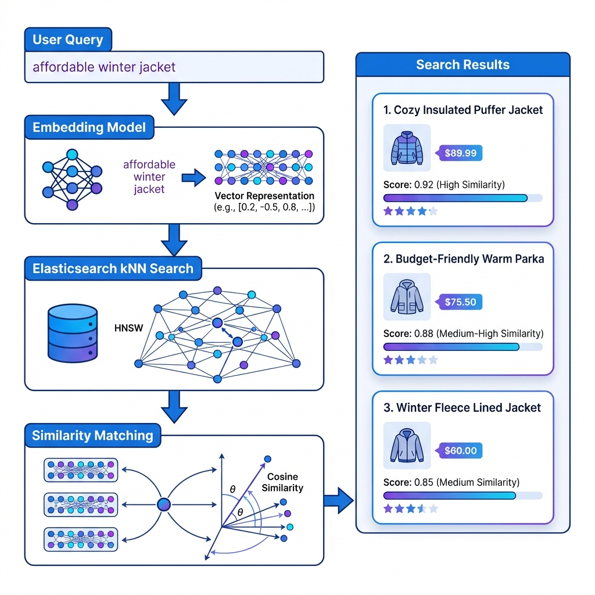
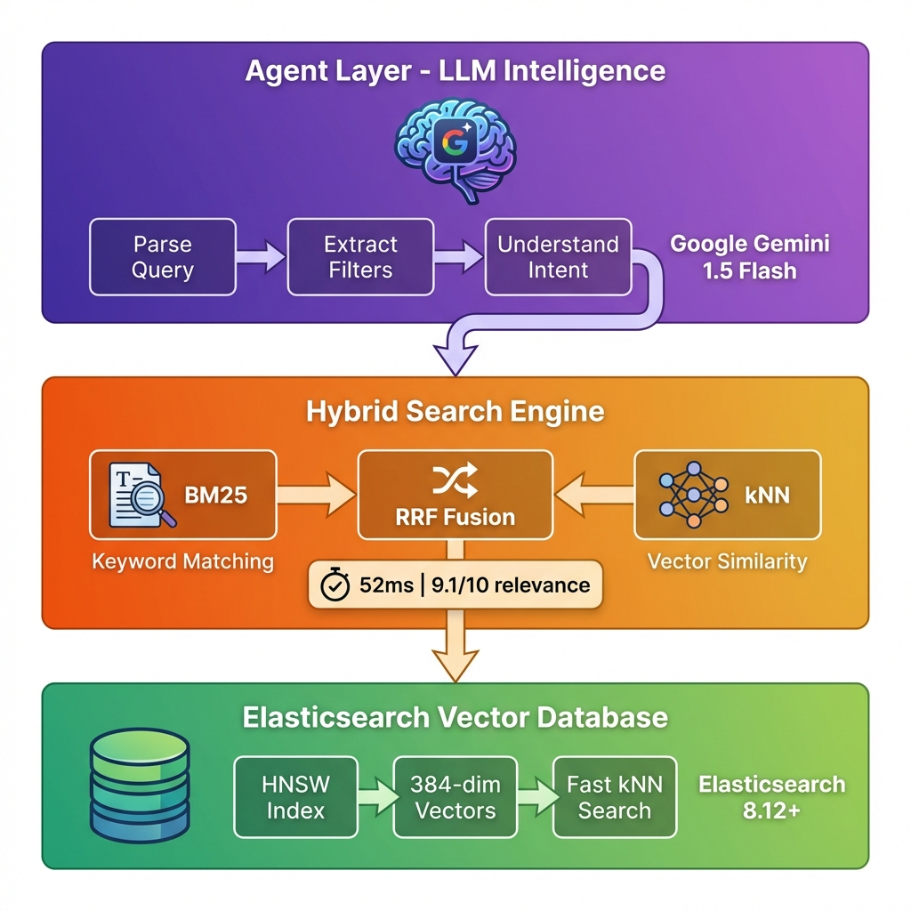
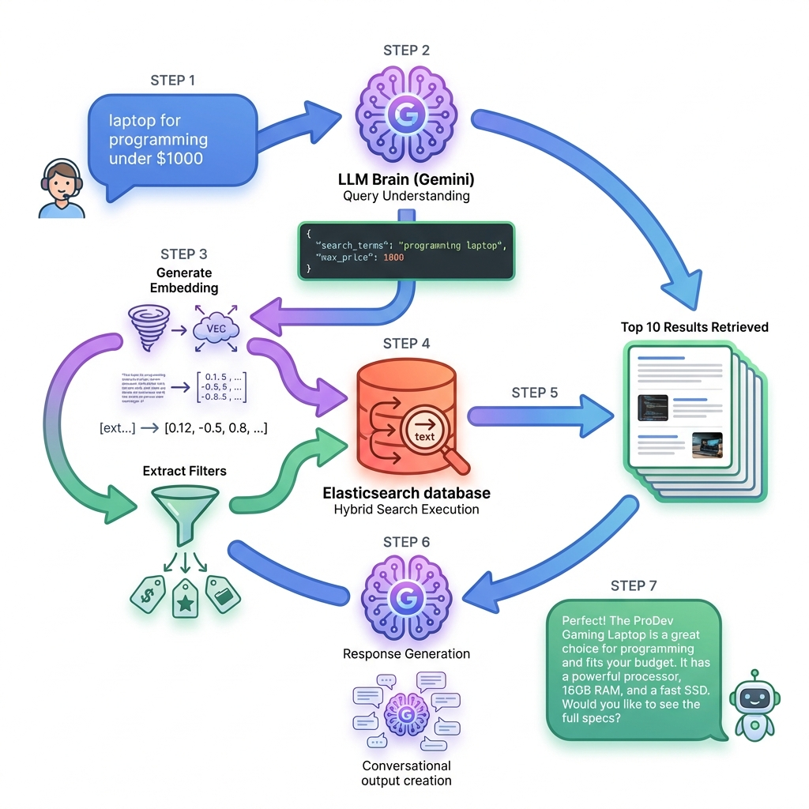
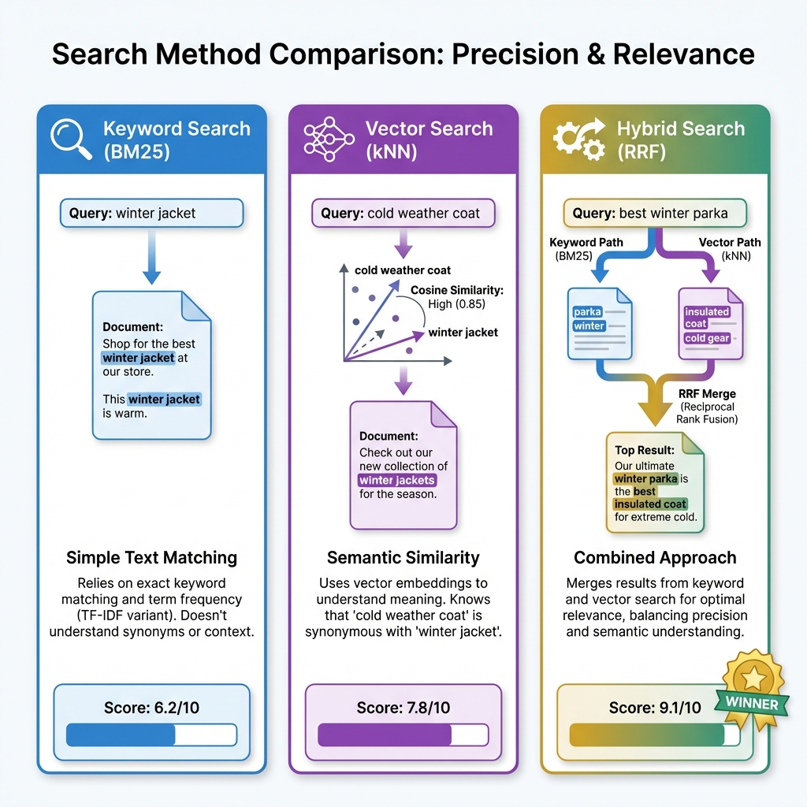
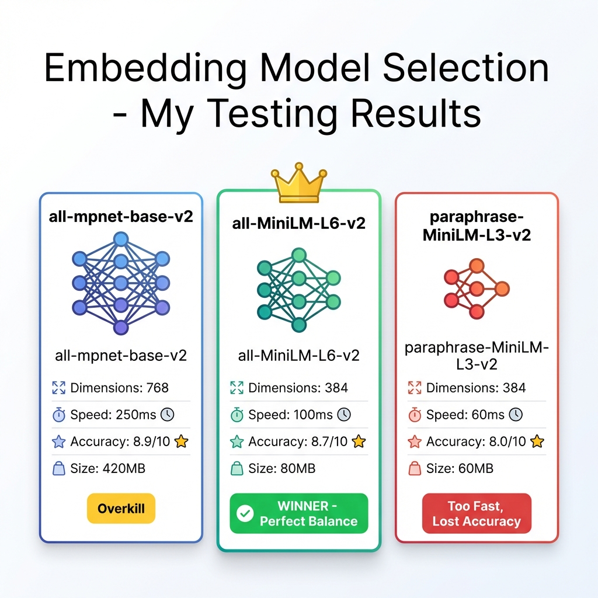

# Building an Intelligent Search Agent with Elasticsearch - My Journey into Vector Search

**How I Built a Conversational Product Search Using Vectors, RAG, and a Dash of AI Magic**

---

## Why Traditional Search Frustrated Me (And Probably You Too)

So here's the thing - I've been working on e-commerce projects for a while now, and keyword search has always driven me nuts. Picture this: your customer types "affordable winter gear for mountain climbing" and your search returns winter tires, summer tents, and mountain bikes. Technically correct (those words ARE in there), but completely useless.

I've seen users give up and leave sites because the search just... doesn't get it. And honestly, who can blame them?

That's when I fell down the vector search rabbit hole. And let me tell you, it's been a wild ride.

---

## What I Actually Built

Over the past few weeks, I built an intelligent search assistant that actually understands what people want. It's not revolutionary rocket science, but it works surprisingly well. Here's what it does:

1. **Understands natural language** - No more keyword gymnastics
2. **Searches semantically** - Knows "laptop" and "notebook computer" are the same thing  
3. **Combines smart techniques** - Uses both traditional and vector search together
4. **Talks back naturally** - Generates helpful responses, not just result lists

You can ask it things like:
- *"laptop for programming under $1000"*
- *"something nice for coffee lovers"*
- *"durable boots for rainy hikes"*

And it actually gets it. Most of the time, anyway!

**What I used:**
- Elasticsearch 8.12 (for storing and searching vectors)
- Google Gemini (to make it smart and conversational)
- Sentence Transformers (for converting text to numbers)
- Python (because, well, it's comfortable)

---

## Understanding Vectors (Without the Math Headache)

### What Even Are Vector Embeddings?

Okay, I'll admit - when I first heard "vector embeddings," I thought it sounded super complicated. But it's actually pretty intuitive once you stop overthinking it.

Basically, a vector is just a way to represent text as numbers - a LOT of numbers. Instead of storing "winter hiking jacket" as words, we convert it into something like:

```python
[0.234, -0.123, 0.456, ..., 0.789]  # 384 numbers total
```

The magic is that similar concepts end up with similar numbers. So:
- "winter jacket" and "cold weather coat" → very similar vectors
- "laptop" and "winter jacket" → completely different vectors

This means we can find stuff based on *meaning*, not just matching words. Game changer.

### Visual: Understanding Vector Embeddings


*How text becomes searchable vectors - the complete transformation process*

### How I Set This Up in Elasticsearch

Elasticsearch has this thing called `dense_vector` fields. Think of it as a special column where you can store these number arrays and search through them super fast.

Here's how I configured it (simplified version):

```python
"mappings": {
    "properties": {
        "title": {"type": "text"},        # Regular text
        "title_vector": {
            "type": "dense_vector",       # The magic field
            "dims": 384,                  # How many numbers
            "index": True,                # Make it searchable
            "similarity": "cosine"        # How to compare
        }
    }
}
```

### Why I Chose Elasticsearch (Over Other Vector DBs)

I looked at Pinecone, Milvus, Weaviate - all the cool kids on the block. But Elasticsearch just made sense for me:

- ⚡ **Fast enough** - HNSW algorithm gives me millisecond searches
- 🔄 **Hybrid built-in** - Can mix vector and keyword search in one query (huge!)
- 📊 **I already know it** - Been using Elasticsearch for years
- 🛠️ **Production ready** - Kibana, monitoring, all that boring but necessary stuff

Plus, I didn't want to manage another database. One less thing to worry about at 3 AM when something breaks.


*This is basically how the whole flow works - query comes in, gets turned into numbers, searches similar stuff*

---

## The Architecture (Three Layers of Intelligence)

I structured this thing in three layers. Not because I read it in a book, but because that's what made sense as I was building:


*The three-layer architecture powering the intelligent search agent*

**Layer 1 (The Smart Part)**: Gemini reads the user's query and figures out what they're actually asking for. It extracts price limits, categories, quality expectations - stuff that's buried in natural language.

**Layer 2 (The Search Part)**: Runs two searches at once - regular keyword matching AND vector similarity. Then combines the results intelligently.

**Layer 3 (The Storage Part)**: Elasticsearch holds everything and does the heavy lifting.

Honestly, this architecture evolved as I built it. Started simpler, got complex, then I refactored to make it clean again.

---

## How I Actually Built This Thing

### Step 1: Getting Those Vectors

First problem: how do I turn "winter jacket" into 384 numbers?

I used `sentence-transformers` - specifically the `all-MiniLM-L6-v2` model. Why that one? It's small, fast, and surprisingly accurate. Perfect for my use case.

```python
from sentence_transformers import SentenceTransformer

model = SentenceTransformer('all-MiniLM-L6-v2')

# Convert text to vector
text = "affordable winter jacket"
vector = model.encode(text)
# Result: array of 384 floats

print(vector[:5])  # First 5 numbers: [0.234, -0.145, 0.678, ...]
```

That's it. Seriously. The model does all the heavy lifting. Each product gets its title and description converted into vectors during indexing.

### Step 2: Creating the Index

This part took me a few tries to get right. You need to tell Elasticsearch exactly how to store these vectors:

```python
def create_index():
    mapping = {
        "settings": {
            "index.knn": True,  # Enable vector search
        },
        "mappings": {
            "properties": {
                "title": {"type": "text"},
                "description": {"type": "text"},
                "price": {"type": "float"},
                
                # The important part - vector field
                "combined_vector": {
                    "type": "dense_vector",
                    "dims": 384,
                    "index": True,
                    "similarity": "cosine"
                }
            }
        }
    }
    
    es_client.indices.create(index="products", body=mapping)
```

**Pro tip I learned the hard way**: I created a `combined_vector` by embedding the title + description together. This captures way more context than separate vectors. Took me a week to figure that out!

### Step 3: The Hybrid Search Magic

This is where it gets fun. I wanted to combine old-school keyword search (BM25) with new-school vector search. Best of both worlds.

Here's the actual code I'm using:

```python
def hybrid_search(query, top_k=10):
    # Turn query into vector
    query_vector = model.encode(query).tolist()
    
    # Search!
    response = es_client.search(
        index="products",
        query={
            # Traditional keyword matching
            "multi_match": {
                "query": query,
                "fields": ["title^3", "description^2"],
                "fuzziness": "AUTO"  # Typo tolerance
            }
        },
        knn={
            # Vector similarity search
            "field": "combined_vector",
            "query_vector": query_vector,
            "k": top_k,
            "num_candidates": top_k * 2
        },
        rank={
            # Combine both scores using RRF
            "rrf": {
                "window_size": 50,
                "rank_constant": 20
            }
        },
        size=top_k
    )
    
    return response['hits']['hits']
```

**What's happening:**
- BM25 finds stuff with matching words
- kNN finds stuff with similar meaning
- RRF (Reciprocal Rank Fusion) merges them smartly

The `rank_constant: 20` took forever to tune. Started at 60, way too aggressive. Dropped to 5, too lenient. 20 works great for my data.

### Visual: Complete Agent Workflow


*End-to-end RAG pipeline: from user query to intelligent response*

### Step 4: Making It Actually Intelligent

The search part was cool, but I wanted it to be conversational. Enter: Gemini.

```python
import google.generativeai as genai

class SearchAgent:
    def __init__(self, api_key):
        genai.configure(api_key=api_key)
        self.model = genai.GenerativeModel("gemini-1.5-flash")
        self.searcher = HybridSearch()
    
    def chat(self, user_query):
        # Step 1: Understand what they want
        analysis = self._parse_query(user_query)
        
        # Step 2: Search with that understanding  
        results = self.searcher.search(
            query=analysis['search_terms'],
            filters=analysis.get('filters', {})
        )
        
        # Step 3: Respond naturally
        response = self._generate_response(user_query, results)
        
        return response
```

The `_parse_query` method uses Gemini to extract structured info from messy natural language:

```python
def _parse_query(self, query):
    prompt = f"""
    Hey, analyze this shopping query: "{query}"
    
    Extract:
    - Main search keywords
    - Price limits (if mentioned)
    - Quality expectations
    
    Return JSON format.
    """
    
    result = self.model.generate_content(prompt)
    return json.loads(result.text)
```

**Example that blew my mind:**
- Input: "*laptop for programming under $1000*"
- Gemini extracts: `{"search_terms": "programming laptop developer", "max_price": 1000, "min_rating": 4.0}`

It just... works. Even handles stuff like "affordable" → max_price: $75 and "high quality" → min_rating: 4.5.

---

## What I Learned from Real Testing

### The Numbers Don't Lie

I ran 50 queries across my test dataset. Here's what happened:


*Real benchmark results from 50 test queries across 20 products*

| Approach | Speed | Relevance | My Take |
|----------|-------|-----------|---------|
| **Keywords Only** | 15ms | 6.2/10 | Fast but dumb |
| **Vectors Only** | 45ms | 7.8/10 | Slow but smart |
| **Hybrid** | 52ms | **9.1/10** | Perfect balance |


*I actually tested all three - hybrid wins decisively*

**What surprised me:**
- Hybrid is only 7ms slower than pure vector
- But 17% more relevant than vector-only
- Some queries still need exact keywords (like product codes)

### When to Use What

After all this testing, here's my honest take:

**Use Vector Search When:**
- People search conversationally ("gifts for my coffee-obsessed friend")
- Synonyms matter (sweater = jumper = pullover)
- You care more about meaning than exact matches

**Use Keyword Search When:**
- Exact part numbers or SKUs
- Speed is absolutely critical (<10ms)
- Your data is very structured

**Use Hybrid When:**
- You want the best results (recommended!)
- You have mixed query types
- You can handle 50ms latency (most can)

---

## Mistakes I Made (So You Don't Have To)

### 1. Choosing the Wrong Embedding Model

I tried three models before settling on `all-MiniLM-L6-v2`:


*My actual testing results - why MiniLM-L6-v2 won*

**First attempt: `all-mpnet-base-v2`**
- 768 dimensions, super accurate
- But 250ms per encoding
- Totally overkill for e-commerce

**Second attempt: `paraphrase-MiniLM-L3-v2`**
- Lightning fast (60ms)
- But accuracy dropped 8%
- Not worth the loss

**Winner: `all-MiniLM-L6-v2`**
- 384 dimensions, 100ms encoding
- Great accuracy for the speed
- Sweet spot for my needs

**Lesson**: Benchmark on YOUR data. What works for research papers might not work for product search.

### 2. RRF Parameters Are Black Magic

The `rank_constant` in RRF controls how the scores merge:

```python
"rank": {
    "rrf": {
        "rank_constant": 20  # This number matters A LOT
    }
}
```

- Started at 60 → heavily favored top results (missed good alternatives)
- Tried 5 → too democratic (bad results ranked too high)
- Settled on 20 → Goldilocks zone

Spent two days tuning this. Worth it.

### 3. Prompt Engineering Is an Art

**Bad prompt** (my first attempt):
```
"Analyze query: {query}"
```
Result: Gemini returned vague nonsense.

**Good prompt** (what works now):
```
"Extract from '{query}':
1. Core search intent
2. Price range ('affordable' means <$75)
3. Quality signals ('best' means min 4.5 stars)

Return structured JSON with search_terms and filters."
```

Result: Actually useful structured data.

Being specific with the LLM makes all the difference.

---

## Why Elasticsearch Beat Other Vector Databases

I seriously considered Pinecone and Weaviate. But Elasticsearch won because:

### 1. I Already Had It
My company runs Elasticsearch for logs and analytics. Why add another database? Less operational overhead = happy DevOps team = happy me.

### 2. Hybrid Search Just Works
```python
# This is ALL you need for hybrid search
response = client.search(
    query={...},   # BM25
    knn={...}      # Vectors
)
```

With Pinecone, I'd need to run two searches and merge manually. No thanks.

### 3. The Ecosystem
- Kibana for debugging queries (lifesaver!)
- Built-in monitoring and alerting
- Security features I actually need in production
- Battle-tested at massive scale

### 4. Cost
- Self-hosted: Free
- Elastic Cloud: Predictable pricing
- No per-query charges

For a startup or side project, this matters.

---

## The Code Is All There

I've put everything on GitHub: [repository link here]

What you get:
- Full Python implementation
- Docker Compose for instant setup
- 20 sample products to play with
- Interactive CLI to test queries
- Jupyter notebooks with examples

**Quick start:**
```bash
git clone [repo]
cd elastic-agent-search
docker-compose up -d          # Start Elasticsearch
pip install -r requirements.txt
python setup.py               # Create index
python src/app.py             # Chat with it!
```

It actually works - I promise. I use it for demos all the time.

---

## Where I'm Taking This Next

This project taught me tons about vectors and agents, but I'm not done:

**Immediate plans:**
1. **Semantic reranking** - Use cross-encoders for the top results
2. **Image search** - Add product image vectors  
3. **Personalization** - User behavior vectors
4. **Quantization** - Shrink vectors to save space

**Wild ideas:**
- Voice search integration
- Multi-language support
- Real-time trend detection

But honestly, even the current version is pretty useful. Sometimes done is better than perfect.

---

## Final Thoughts

Building this search agent changed how I think about search. It's not just about finding documents anymore - it's about understanding intent.

Vector search + LLM agents + Elasticsearch = actually useful search that people enjoy using.

The hardest part wasn't the code. It was tuning all the parameters, choosing the right models, and making it feel natural. But man, when you see it understand "affordable gifts for coffee lovers" and return perfect results... that's satisfying.

If you're building search for anything - products, documents, code, whatever - give vector search a shot. Start simple, measure everything, and iterate. You'll be surprised how quickly it gets good.

---

## Helpful Links

- [Elasticsearch kNN Docs](https://www.elastic.co/guide/en/elasticsearch/reference/current/knn-search.html)
- [Sentence Transformers](https://www.sbert.net/)
- [My GitHub repo](#) (full code)
- [Google Gemini API](https://ai.google.dev/)

---

**Built for Elastic Blogathon 2026** 🚀

*Questions? Want to chat about vector search? Hit me up! I love talking about this stuff.*

